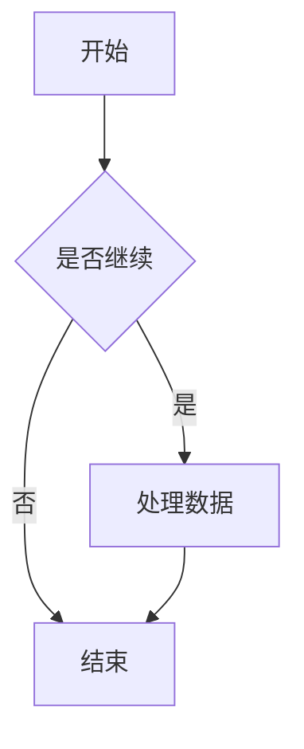
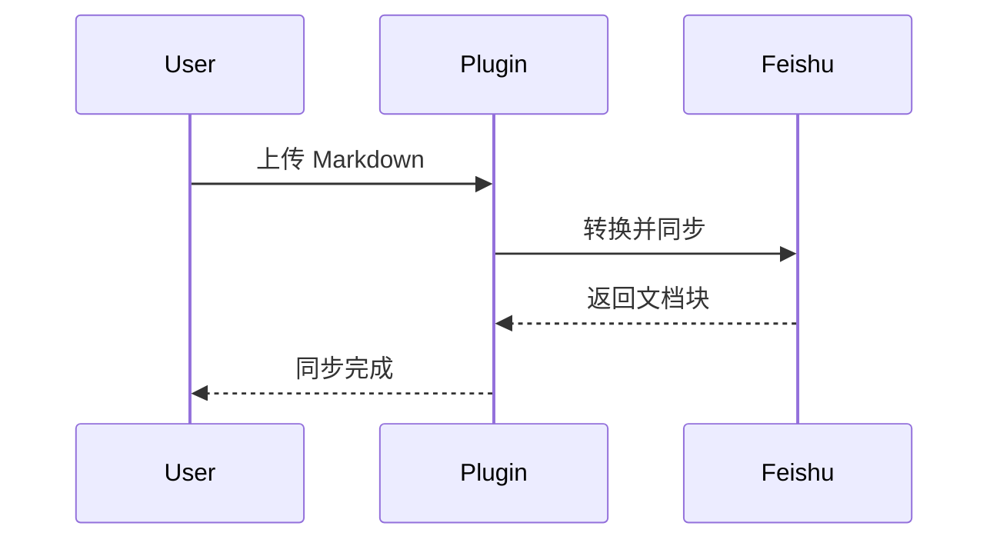
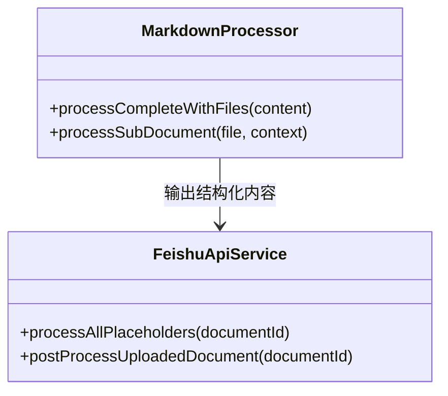
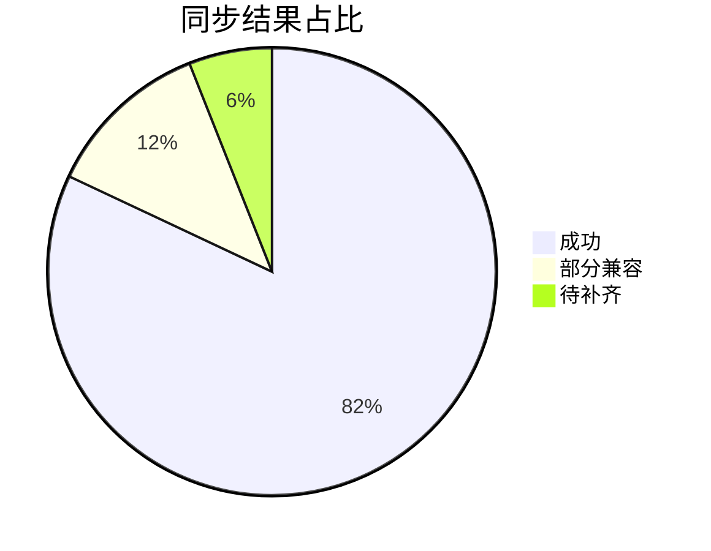
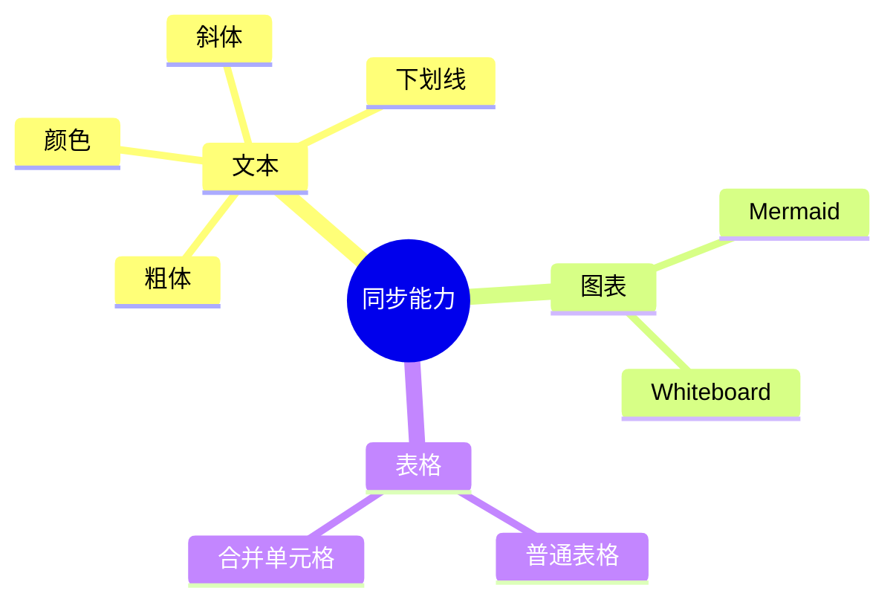

# 飞书同步语法冒烟样例

这份文件用于验证 Obsidian -> 飞书文档上传同步时的核心格式转换效果。

## 标题层级

# 一级标题
## 二级标题
### 三级标题
#### 四级标题
##### 五级标题
###### 六级标题

## 文本样式

普通文本、**粗体**、*斜体*、~~删除线~~、`行内代码`、<u>下划线</u>。

颜色样式：
<span style="color:gray">灰色文本</span>
<span style="color:brown">棕色文本</span>
<span style="color:orange">橙色文本</span>
<span style="color:yellow">黄色文本</span>
<span style="color:green">绿色文本</span>
<span style="color:blue">蓝色文本</span>
<span style="color:purple">紫色文本</span>

高亮样式：
==这是高亮文本==

复杂混排：
这一行同时包含 **粗体**、*斜体*、~~删除线~~、`inline code`、<u>下划线</u>、<span style="color:blue">蓝色文字</span>，以及行内公式 $E=mc^2$。

连续样式边界：
**粗体开始**紧接着普通文本，再接<span style="color:green">绿色文本</span>，然后是<u>下划线文本</u>和`尾部代码`。

## 公式

行内公式：设 $a^2+b^2=c^2$。

块公式：

$$
\int_0^1 x^2 \, dx = \frac{1}{3}
$$

## 列表

- 无序列表 1
- 无序列表 2
    - 二级无序列表
    - 二级无序列表里的 **粗体**

1. 有序列表 1
2. 有序列表 2
    1. 二级有序列表
    2. 二级有序列表里的 `inline code`

- [ ] 未完成任务
- [x] 已完成任务

复杂嵌套列表：

1. 一级有序列表
    - 二级无序列表 A
    - 二级无序列表 B
        1. 三级有序列表 1
        2. 三级有序列表 2，含 **粗体** 和 $x+y$
2. 一级有序列表结束

- 顶层任务列表
    - [ ] 二级未完成
    - [x] 二级已完成，含 `inline code`
        - 三级补充说明

## Callout

> [!NOTE] 说明型 Callout
> 这是一段用于测试 Callout 的内容，里面包含 **粗体**、*斜体*、`代码` 和 ~~删除线~~。

> [!TIP] 提示型 Callout
> 第一行内容
>
> 第二行内容，带 <u>下划线</u> 和 <span style="color:purple">紫色文字</span>。

## 引用

> 这是一级引用。
>
> 这一段用于观察飞书引用块的转换效果。

复杂引用：

> 第一层引用
>
> - 引用中的列表 1
> - 引用中的列表 2
>
> 引用里的结尾段落，含 $a+b$。

## 代码块

```ts
type User = {
	name: string;
	role: 'admin' | 'reader';
};

const user: User = {
	name: 'Anchor',
	role: 'admin'
};
```

```python
def greet(name: str) -> str:
    return f"hello, {name}"
```

```json
{
  "name": "feishu-share",
  "features": ["mermaid", "table", "whiteboard", "equation"],
  "stable": true
}
```

## Mermaid











## 表格

普通表格：

<table>
<tr><td>列 1</td><td>列 2</td><td>列 3</td></tr>
<tr><td>文本</td><td><strong>粗体</strong></td><td><code>code</code></td></tr>
<tr><td>蓝色</td><td><span style="color:blue">颜色文本</span></td><td>第三列</td></tr>
</table>

带合并单元格：

<table>
<tr><td rowspan="2">左侧纵向合并</td><td>右上</td><td>右上 2</td></tr>
<tr><td colspan="2">右下横向合并</td></tr>
</table>

多行内容表格：

<table>
<tr><td>标题</td><td>内容</td><td>备注</td></tr>
<tr><td>第一行</td><td>单元格第一行<br/>单元格第二行</td><td>普通文本</td></tr>
<tr><td>第二行</td><td>这里有 &lt;HTML 实体&gt; 和 &amp; 符号</td><td>结束</td></tr>
</table>

复杂合并表格：

<table>
<tr><td rowspan="2">纵向合并 A</td><td>B1</td><td>C1</td><td>D1</td></tr>
<tr><td colspan="2">B2C2 横向合并</td><td>D2</td></tr>
<tr><td>A3</td><td>B3</td><td colspan="2">C3D3 横向合并</td></tr>
</table>

## 交错块顺序

这段用于验证表格、画板、Mermaid 混排时，飞书中的插入顺序是否和 Markdown 原文一致。

<table>
<tr><td>顺序块 1</td><td>表格应出现在这里</td></tr>
</table>

[Whiteboard]


中间普通段落，用来检查结构化块之间的段落是否被保留。

## 画板占位

[Whiteboard]

## 分隔线

---

## 最后一段

如果这份文件上传后，标题、行内样式、公式、列表、代码块、Mermaid、表格、画板占位都表现正常，就说明当前这批核心转换基本打通了。
